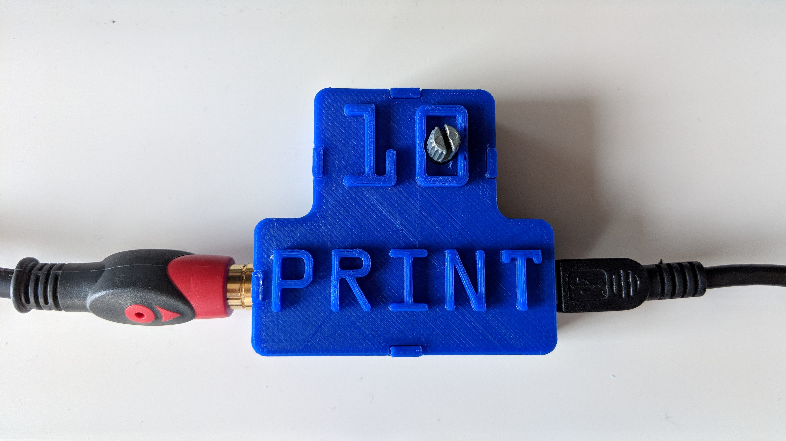
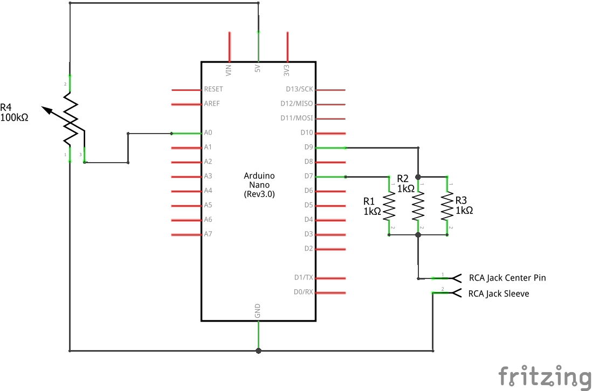

# 10 Print Box

A simple implementation of the [10 print algorithm](https://10print.org) on Arduino, with native TV output.
A potentiometer adjusts the probability threshold, allowing you to change the patterns which are generated!

## Hardware

The 10 Print Box is based on an Arduino Nano, although the code will run on most of the Arduino range. The compatibility is dependent on the platforms supported by the [TVOut library](https://playground.arduino.cc/Main/TVout).

To build the box, you'll need:
- An Arduino Nano
- A linear potentiometer (mine was 100k, but 10k should also be fine)
- A female RCA jack (or a male one if you don't want to plug a cable between the box and the TV)
- The two 3D printed box parts (STL files are included in this repository)
- Either:
  - One 470 Ohm resistor and one 1K Ohm resistor
  - Three 1K Ohm resistors (this is what I used as I had them to hand)

## Build

The build is pretty much as simple as soldering everything together following the schematic! It might be best to build the circuit on a breadboard first, and upload the "10Print.ino" file to the Arduino. If you don't know how to upload code to an Arduino, have a look [here.](https://www.arduino.cc/en/Main/Howto).

Before you upload the code to the Arduino, be sure to check that the code has the correct video output for your TV. If you're in a PAL region, you can use the code as provided. If you're in an NTSC region, you'll need to change one line (don't worry, it's easy and labelled!). If you don't know which region you're in, see the [useful graphic on this page.](https://en.wikipedia.org/wiki/PAL)

If you're using a 470 Ohm resistor, replace the two 1K ohm resistors in parallel with this.

The resistors that come from pin 7 and 9 of the Arduino connect together, and then connect to the centre pin of the RCA jack (this isn't obvious in the Fritzing diagram, sorry!). The sleeve of the RCA jack connects to one of the GND pins on the Arduino.

If you're using the 3D printed box, I'd recommend holding everything together with a few blobs of hot glue, or something similar. Make sure you test it's working before you hot glue it!

## Questions?
If you have any questions, feel free to [tweet me](https://twitter.com/walkerdanny) or open an issue on this repository.

## Thanks
Thanks to [Daniel Shiffman](https://github.com/shiffman) for the inspiration, and to [Noopkat](https://github.com/noopkat) for the idea to do it in hardware! Follow them both, they do good things.
